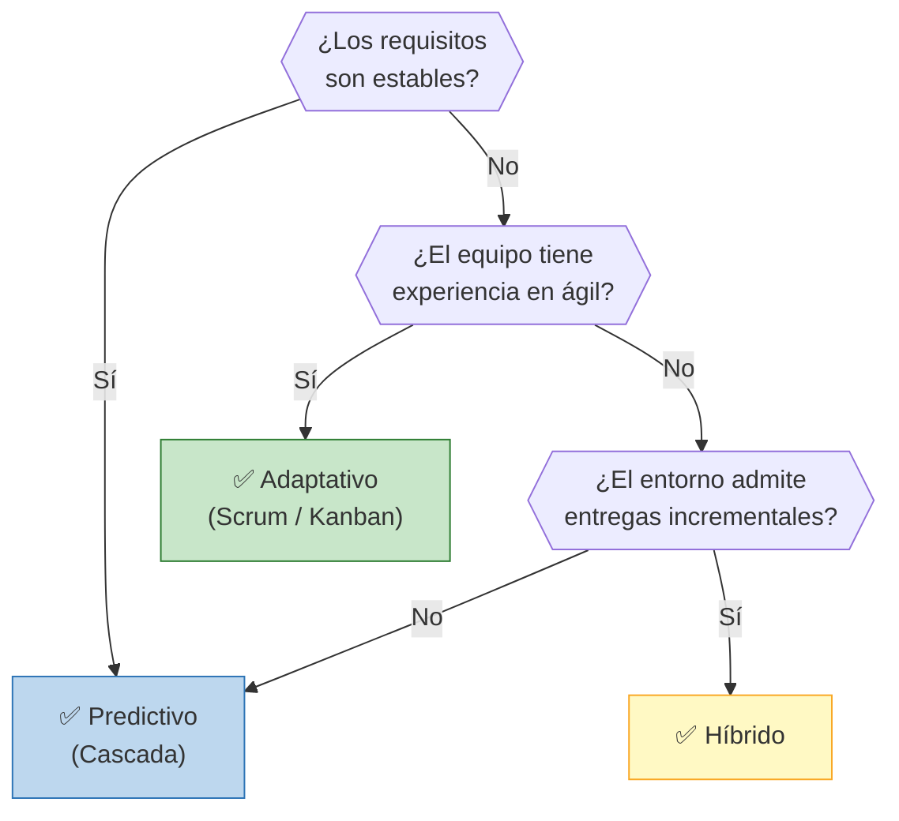
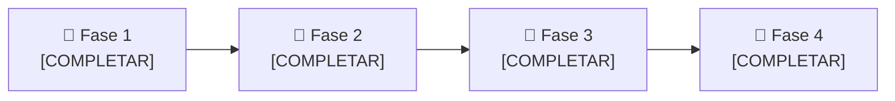

# 🔄 Ciclo de Vida del Proyecto

## Enfoque seleccionado

> **Híbrido**

## Justificación de la elección

> [COMPLETAR: explicar por qué este enfoque es el más adecuado para el proyecto, considerando características como: complejidad, claridad de requisitos, tamaño del equipo, tolerancia al cambio, experiencia del equipo, etc.]
> Si bien conocemos, a priori, los distintos pasos para llevar a cabo el proyecto, también tenemos en cuenta limitaciones tecnológicas y burocraticas, por esto consideramos un enfoque hibrido.
> La complejidad del proyecto es moderada en cuanto a su implementación, el equipo tiene experiencia relativa en cuanto al procesamiento digital de señales e implementación de hardware para adquisición de señales. Al analizar el proyecto en fases, la relacionada a la construcción del clasificador de las señales de audio, el equipo no posee experiencia en generar en algoritmos de clasificación y/o clasificadores en general.
> El equipo es flexible en la adaptación al cambio, por lo que un enfoque que se aproxime a ágil no es algo desconocido para el desarrollo de un proyecto. 

## Árbol de decisión

> **Decisión del grupo:** [COMPLETAR: indicar cuál rama del árbol aplica a su caso y por qué]

## Fases del proyecto

| Fase | Nombre | Objetivo | Criterio de salida |
|------|--------|----------|-------------------|
| 1 | [Inicio] | [COMPLETAR] | [COMPLETAR] |
| 2 | [Planificación] | [COMPLETAR] | [COMPLETAR] |
| 3 | [COMPLETAR] | [COMPLETAR] | [COMPLETAR] |
| 4 | [COMPLETAR] | [COMPLETAR] | [COMPLETAR] |

---

*Cátedra Gestión de Proyectos · FIUNER · 2026*
