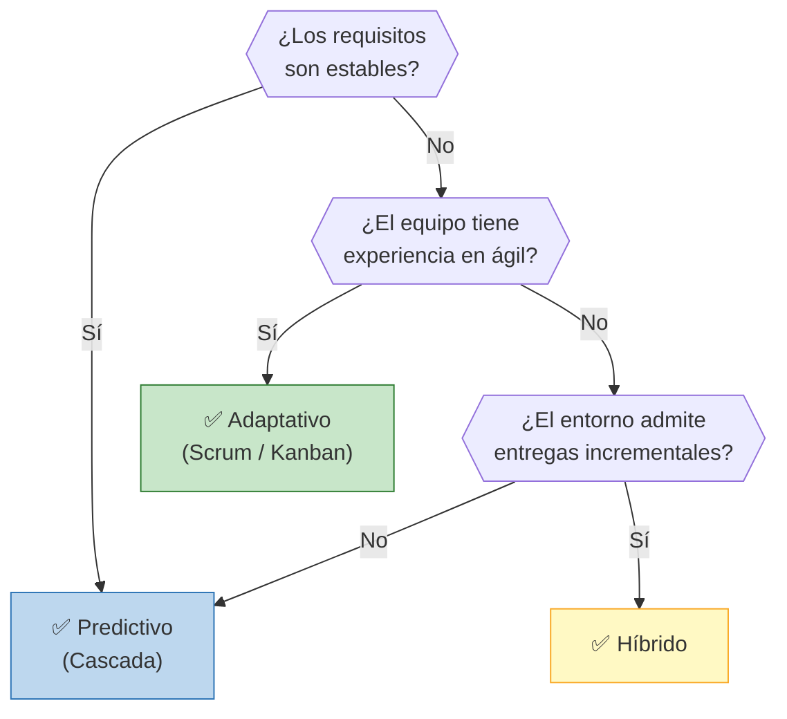

# 🔄 Ciclo de Vida del Proyecto

## Enfoque seleccionado

> **Híbrido**

## Justificación de la elección

>El proyecto combina investigación científica, desarrollo de hardware físico y diseño de software. Debido a esta naturaleza multidisciplinaria, un enfoque híbrido representa la estrategia más segura, eficiente y coherente por las siguientes razones:

>Requisitos de Hardware Estables y Predictivos: El diseño físico de adquisición de audio cuenta con especificaciones de hardware y restricciones de campo bien delimitadas desde el inicio (carcasa estanca, micrófonos, sistema de alimentación y almacenamiento local). Cambiar componentes físicos a mitad del proyecto genera costos operativos y logísticos prohibitivos. Por lo tanto, esta sección del proyecto se gestiona bajo un enfoque predictivo (en cascada), con hitos claros de diseño, ensamble y pruebas de campo iniciales.

>Complejidad, Experimentación e Iteración de Software e IA: El desarrollo del clasificador de audio basado en Inteligencia Artificial para separar cantos de aves del ruido de la actividad humana, así como la calibración del Índice de Calidad Acústico-Ecológica, posee un carácter altamente experimental y evolutivo. El equipo de proyecto posee experiencia relativa en el procesamiento de señales, pero afronta el desafío del entrenamiento de redes neuronales y algoritmos sobre datos de audio reales recogidos en campo. Esto exige un enfoque adaptativo e iterativo, que permite calibrar los modelos conforme se expande la base de datos acústica y se validan las métricas científicas de contraste (NDSI) y complejidad (ACI).

>Tolerancia al Cambio y Estructura del Equipo: El equipo técnico presenta una alta adaptabilidad y familiaridad con metodologías ágiles de software. La hibridación permite aprovechar esta flexibilidad en la fase de programación y entrenamiento del clasificador de IA, mientras se mantiene el rigor predictivo necesario para el cumplimiento de plazos y la rendición al Sponsor.

## Árbol de decisión

> **Decisión del grupo:** Se opta por la rama de Enfoque Híbrido. La rama predictiva pura no se adapta debido al carácter experimental de la clasificación por IA y la necesidad de ajustar los índices ecológicos en el sitio de estudio. Por otro lado, un enfoque ágil/adaptativo puro no es idóneo para la especificación del hardware de adquisición, donde los cambios de componentes o requerimientos físicos a mitad de camino incrementan drásticamente los costos operativos.

## Fases del proyecto

| Fase | Nombre | Objetivo | Criterio de salida |
|------|--------|----------|-------------------|
| 1 | Concepción y Diseño del Sistema | [Definir la arquitectura general del sistema (hardware de grabación y estructura de datos) y establecer el protocolo de muestreo inicial para Oro Verde/Paraná.] | [Documento de arquitectura aprobado y hardware/micrófonos de adquisición seleccionados e integrados.] |
| 2 | Desarrollo del Dispositivo y Captura Piloto | [Construir el prototipo autónomo de grabación y realizar los primeros despliegues de campo para recopilar registros acústicos de prueba.] | [Prototipo funcional desplegado en campo con almacenamiento exitoso de archivos de audio.] |
| 3 | Desarrollo del Modelo IA e Índices | [Entrenar y validar los modelos de IA para la clasificación de fuentes sonoras (aves vs. antropofonía) y calcular los índices de calidad acústico-ecológica.] | [Algoritmo de clasificación con porcentaje de precisión validado e índices calculados sobre la base de datos piloto.] |
| 4 | Integración, Visualización y Entrega | [Integrar el sistema de software con la base de datos y la interfaz gráfica/mapa de indicadores para los usuarios finales.] | [Plataforma o mapa de visualización funcional con informes generados para la gestión ambiental.] |

---

*Cátedra Gestión de Proyectos · FIUNER · 2026*
