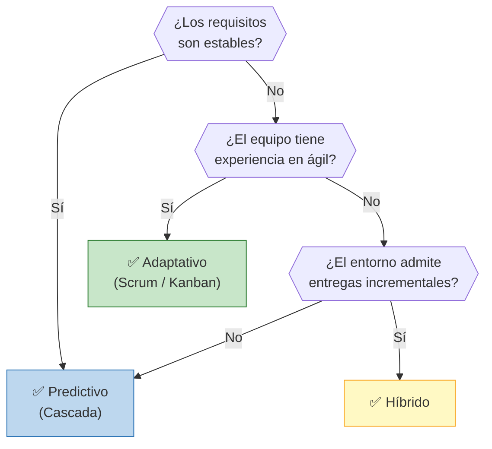
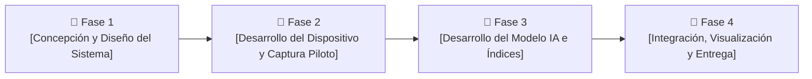

# 🔄 Ciclo de Vida del Proyecto

## Enfoque seleccionado

> **Híbrido**

## Justificación de la elección

> [COMPLETAR: explicar por qué este enfoque es el más adecuado para el proyecto, considerando características como: complejidad, claridad de requisitos, tamaño del equipo, tolerancia al cambio, experiencia del equipo, etc.]
> A priori se conocen los distintos pasos para llevar a cabo el proyecto, pero existen limitaciones tecnológicas y burocráticas que exigen este tipo de abordaje. La complejidad del proyecto es moderada en cuanto a su implementación. En el aspecto técnico, el equipo posee experiencia relativa en el procesamiento digital de señales e implementación de hardware para la adquisición de señales, lo que permite abordar la adquisición del dispositivo físico de grabación y la configuración inicial del almacenamiento desde un enfoque predictivo, ya que los requisitos de captura de audio están claramente acotados desde el inicio. Sin embargo, al analizar el proyecto en fases, la relacionada a la construcción del clasificador de las señales de audio presenta un desafío importante, dado que el equipo no posee experiencia previa en la generación de algoritmos de clasificación ni de clasificadores en general. Por este motivo, la identificación de fauna/actividad humana mediante IA, el algoritmo de procesamiento de señales y la calibración del Índice de Calidad Acústico-Ecológica (como el NDSI o ACI) implican una alta complejidad, aprendizaje continuo y la necesidad de validación experimental en campo. Esto requiere un enfoque adaptativo e iterativo para ajustar los modelos analíticos conforme se recolectan los datos. Finalmente, la justificación se respalda en que el equipo es flexible en la adaptación al cambio, por lo que un enfoque que se aproxime a lo ágil resulta adecuado y familiar para el desarrollo del proyecto. 

## Árbol de decisión

> **Decisión del grupo:** Se opta por la rama de Enfoque Híbrido. La rama predictiva pura no se adapta debido al carácter experimental de la clasificación por IA y la necesidad de ajustar los índices ecológicos en el sitio de estudio. Por otro lado, un enfoque ágil/adaptativo puro no es idóneo para la especificación del hardware de adquisición, donde los cambios de componentes o requerimientos físicos a mitad de camino incrementan drásticamente los costos operativos.

## Fases del proyecto

| Fase | Nombre | Objetivo | Criterio de salida |
|------|--------|----------|-------------------|
| 1 | [Concepción y Diseño del Sistema] | [Definir la arquitectura general del sistema (hardware de grabación y estructura de datos) y establecer el protocolo de muestreo inicial para Oro Verde/Paraná.] | [Documento de arquitectura aprobado y hardware/micrófonos de adquisición seleccionados e integrados.] |
| 2 | [Desarrollo del Dispositivo y Captura Piloto] | [Construir el prototipo autónomo de grabación y realizar los primeros despliegues de campo para recopilar registros acústicos de prueba.] | [Prototipo funcional desplegado en campo con almacenamiento exitoso de archivos de audio.] |
| 3 | [Desarrollo del Modelo IA e Índices] | [Entrenar y validar los modelos de IA para la clasificación de fuentes sonoras (aves vs. antropofonía) y calcular los índices de calidad acústico-ecológica.] | [Algoritmo de clasificación con porcentaje de precisión validado e índices calculados sobre la base de datos piloto.] |
| 4 | [Integración, Visualización y Entrega] | [Integrar el sistema de software con la base de datos y la interfaz gráfica/mapa de indicadores para los usuarios finales.] | [Plataforma o mapa de visualización funcional con informes generados para la gestión ambiental.] |

---

*Cátedra Gestión de Proyectos · FIUNER · 2026*
