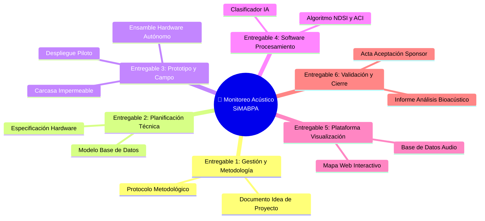

# 📦 Entregables Principales del Proyecto

## Lista de entregables

## Detalle de entregables

| # | Entregable | Descripción | Responsable | Criterio de aceptación |
|---|-----------|-------------|------------|------------------------|
| 1 | [		Dispositivo Autónomo de Grabación ] | [Gabinete estanco instalado físicamente en el sitio de registro, capaz de operar a la intemperie y recolectar audio de alta fidelidad.] | [ Responsable de Hardware e Infraestructura ] | [ Autonomía mínima certificada de 48 horas continuas de grabación activa.- Resistencia a la intemperie según estándar IP65 (protección contra lluvia y humedad).- Almacenamiento del registro en tarjeta de memoria sin pérdida de datos. ] |
| 2 | [Plataforma de Visualización] | [mapa local interactivo que permita al personal del parque o municipio visualizar georreferencialmente las métricas obtenidas.] | [Responsable de Datos y Visualización] | [- Interfaz gráfica amigable que muestre los puntos de monitoreo en un mapa de la zona y representación visual de los índices NDSI y ACI por punto de muestreo.] |
| 3 | [	Informe de Diagnóstico Acústico-Ecológico Inicial ] | [ Reporte técnico y de negocio que traduce los índices para informar intuitivamente la conservación urbana y de biodiversidad en Entre Ríos. ] | [Especialista en Bioacústica y Conservación / PM] | [ Documento con análisis comparativo del estado de conservación entre los distintos puntos de muestreo (zona conservada vs. zona urbana).- ] |

## Exclusiones del alcance

- Ámbito Geográfico Extendido: El desarrollo del monitoreo acústico y los despliegues de campo se limitarán de forma estricta a las áreas naturales protegidas, espacios verdes y zonas periurbanas de las localidades de Oro Verde y Paraná en la provincia de Entre Ríos; no se incluye la implementación en otras provincias o regiones de Argentina.
- Riqueza de Especies Específicas: El sistema y el clasificador por Inteligencia Artificial estarán diseñados para discriminar de manera binaria entre señales de aves en general y ruidos antropogénicos de perturbación; no está incluido en el alcance la identificación de especies específicas de aves ni la caracterización acústica de otros grupos de fauna .
- Clasificación de Fuentes Específicas de Ruido: El software no diferenciará entre diferentes tipos de perturbaciones humanas.
- Transmisión de Datos Inalámbrica y Tiempo Real: No se incluye la transmisión inalámbrica de señales en tiempo real en los sitios de monitoreo.
- Diseño a Medida de Placas de Circuito Impreso: El hardware del dispositivo se basará estrictamente en el ensamble e integración de componentes y placas de desarrollo comerciales disponibles en el mercado; queda fuera del alcance el desarrollo y fabricación industrial de placas de circuitos electrónicos diseñados desde cero.
- Seguridad Física de los Equipos de Campo: El proyecto no incluye el costo de infraestructura de seguridad física adicional contra el robo o vandalismo en las zonas de despliegue.
---

*Cátedra Gestión de Proyectos · FIUNER · 2026*
