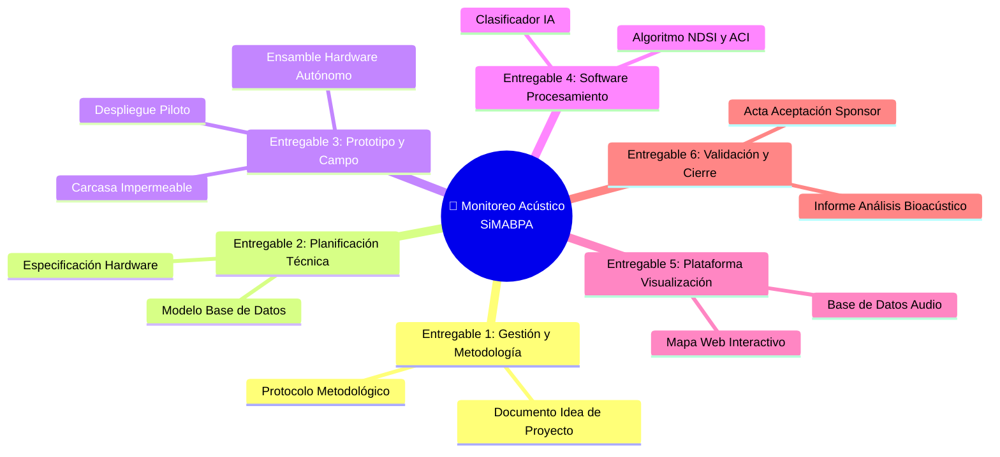

# 📦 Entregables Principales del Proyecto

## Lista de entregables

## Detalle de entregables

| # | Entregable | Descripción | Responsable | Criterio de aceptación |
|---|-----------|-------------|------------|------------------------|
| 1 | [	Documento de Inicio y Marco Metodológico] | [Documento formal que incluye los objetivos del proyecto, el alcance del monitoreo acústico de aves, y la investigación de estándares internacionales] | [Especialista en Bioacústica y Asesor Ambiental / Director de Proyecto] | [Aprobación escrita de la cátedra de gestión de proyectos y validación metodológica del protocolo por parte del asesor técnico del equipo.] |
| 2 | [Especificación de Planificación Técnica (Hardware + Software)] | [Se diseña y presentan el software de procesamiento de señales y las especificaciones técnicas del hardware] | [Responsable de Hardware / Responsable de Software e IA] | [Documento de diseño arquitectónico unificado aprobado internamente por el equipo técnico del proyecto.] |
| 3 | [Prototipo Físico Autónomo de Adquisición de Sonido] | [Dispositivo físico autónomo completamente ensamblado e instalado en su contenedor estanco (carcasa protectora de intemperie), con alimentación por batería recargable y capacidad de almacenamiento local de grabaciones acústicas.] | [Responsable de Hardware e Infraestructura de Campo] | [Funcionamiento continuo del dispositivo autónomo, registrando audio localmente en campo] |
| 4 | [	Módulo de Procesamiento de IA y Cálculo de Índice] | [software funcional que procesa los archivos acústicos recolectados en campo, ejecuta el clasificador basado en Inteligencia Artificial para discriminar entre cantos de aves y ruido humano, y calcula automáticamente los índices bioacústicos NDSI y ACI.] | [Responsable de Software e IA / Especialista en Bioacústica] | [Validación matemática de los algoritmos de cálculo de índices y un modelo de IA que alcance un porcentaje mínimo de precisión predefinido.] |
| 5 | [Base de Datos y Plataforma de Visualización] | [Repositorio organizado de datos acústicos e indicadores con un mapa que presenta de forma gráfica la ubicación de los puntos de monitoreo y la variación temporal de la calidad acústico-ecológica] | [Responsable de Datos y Visualización] | [Interfaz de usuario operativa, que cargue y visualice los mapas de calor e históricos de NDSI y ACI de forma fluida y sin errores de base de datos.] |
| 6 | [Informe de Análisis Comparativo y Cierre de Proyecto]|[nforme consolidado que compara la actividad bioacústica y la perturbación humana entre las zonas monitoreadas. Incluye la documentación del feedback de uso por parte del personal de conservación y el acta de entrega final al Sponsor.]| [Director de Proyecto (PM) / Especialista en Bioacústica] | [Firma del acta de recepción final del proyecto y conformidad de los resultados por parte de los representantes del Organismo Estatal de Conservación (Sponsor).] |

## Exclusiones del alcance

> [COMPLETAR: indicar explícitamente qué NO está incluido en el proyecto para evitar ambigüedades]

- Ámbito Geográfico Extendido: El desarrollo del monitoreo acústico y los despliegues de campo se limitarán de forma estricta a las áreas naturales protegidas, espacios verdes y zonas periurbanas de las localidades de Oro Verde y Paraná en la provincia de Entre Ríos; no se incluye la implementación en otras provincias o regiones de Argentina.
- Riqueza de Especies Específicas: El sistema y el clasificador por Inteligencia Artificial estarán diseñados para discriminar de manera binaria entre señales de aves en general y ruidos antropogénicos de perturbación; no está incluido en el alcance la identificación de especies específicas de aves ni la caracterización acústica de otros grupos de fauna .
- Clasificación de Fuentes Específicas de Ruido: El software no diferenciará entre diferentes tipos de perturbaciones humanas.
- Transmisión de Datos Inalámbrica y Tiempo Real: No se incluye la transmisión inalámbrica de señales en tiempo real en los sitios de monitoreo.
- Diseño a Medida de Placas de Circuito Impreso: El hardware del dispositivo se basará estrictamente en el ensamble e integración de componentes y placas de desarrollo comerciales disponibles en el mercado; queda fuera del alcance el desarrollo y fabricación industrial de placas de circuitos electrónicos diseñados desde cero.
- Seguridad Física de los Equipos de Campo: El proyecto no incluye el costo de infraestructura de seguridad física adicional contra el robo o vandalismo en las zonas de despliegue.
---

*Cátedra Gestión de Proyectos · FIUNER · 2026*
