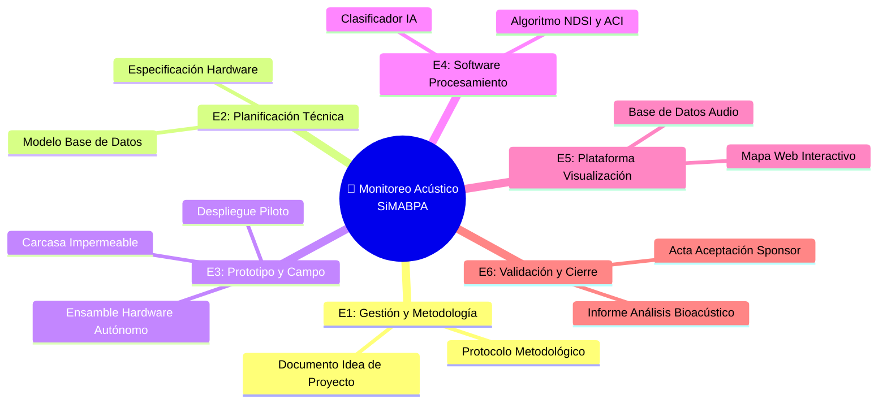

# 📦 Entregables Principales del Proyecto

## Lista de entregables

## Detalle de entregables

| # | Entregable | Descripción | Responsable | Criterio de aceptación |
|---|-----------|-------------|------------|------------------------|
| 1 | [Documento con idea proyecto] | [Se presentan objetivos, alcances y enfoque del proyecto] | [COMPLETAR] | [COMPLETAR] |
| 2 | [Planificación software + hardware] | [Se diseña y presentan el software de procesamiento de señales y las especificaciones técnicas del hardware] | [COMPLETAR] | [COMPLETAR] |
| 3 | [Implementación y validación de la herramienta] | [Se testea el desarrollo y se comparan los resultados con otras herramientas y técnicas ya validadas] | [COMPLETAR] | [COMPLETAR] |
| 4 | [Reajuste del dispositivo] | [Instancia post evaluación en donde se realiza una puesta a punto del instrumento] | [COMPLETAR] | [COMPLETAR] |
| 5 | [Vinculación y feedback de partes interesadas] | [Uso del dispositivo por parte del personal pertinente y seguimiento de resultados en locación específica] | [COMPLETAR] | [COMPLETAR] |

## Exclusiones del alcance

> [COMPLETAR: indicar explícitamente qué NO está incluido en el proyecto para evitar ambigüedades]

- El desarrollo solo se implementará con los organismos pertinentes de las reservas naturales de Entre Ríos, y no en la otras provincias de Argentina.
- El dispositivo solo estará diseñado para discernir y caracterizar el sonido de las aves y la actividad antropogénica; pero no de otras especies de fauna.

---

*Cátedra Gestión de Proyectos · FIUNER · 2026*
