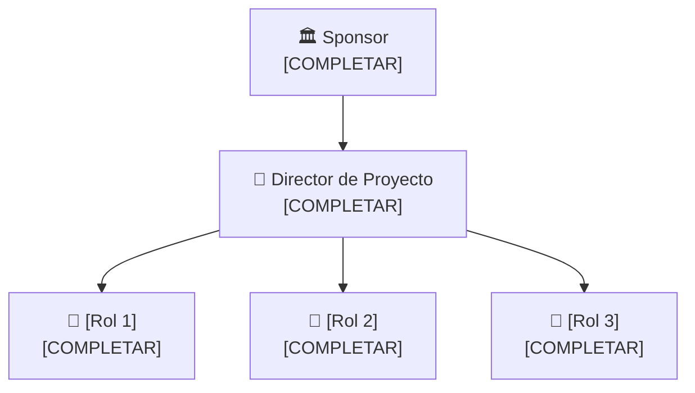

# 🏢 Organización del Proyecto

## Usuarios e interesados (Stakeholders)

| Nombre / Rol | Área | Interés en el proyecto | Influencia |
|--------------|------|------------------------|-----------|
| [Organismo responsable de la gestión ambiental] | [Gestión ambiental municipal] | [Obtener información continua para monitorear espacios naturales y detectar posibles perturbaciones] | Alta  |
| [Administrador del espacio natural] | [Conservación / Gestión del territorio] | [Conocer la actividad de fauna y el nivel de perturbación sonora del sitio] | Alta |
| [Grupo de investigación] | [Investigación y desarrollo] | [Utilizar los registros acústicos para validar el sistema y generar conocimiento sobre el monitoreo ambiental] | Media |
| [Organizaciones ambientales] | [Conservación] | [Disponer de una herramienta de bajo costo para realizar monitoreo acústico] | Media |
## Áreas involucradas

- Gestión ambiental: define las necesidades de monitoreo, los sitios de interés y el uso de los indicadores generados.
- Bioingeniería / Electrónica: desarrolla el dispositivo de adquisición de audio, alimentación y funcionamiento autónomo.
- Procesamiento de señales e Inteligencia Artificial: desarrolla los algoritmos para procesar y clasificar los registros acústicos.
- Biodiversidad / Ciencias ambientales: aporta criterios para la identificación de fauna y valida la interpretación de los resultados.
## Equipo del proyecto

| Integrante | Rol en el proyecto | Responsabilidad principal |
|------------|--------------------|--------------------------|
| [COMPLETAR] | Director / Líder de Proyecto | [Coordinar el proyecto, gestionar recursos, plazos y entregables y mantener la comunicación con los interesados] |
| [COMPLETAR] | [Responsable de Hardware] | [Diseñar e implementar el sistema de adquisición de audio, alimentación y almacenamiento] |
| [COMPLETAR] | [Responsable de Software e IA] | [Desarrollar el procesamiento de señales, clasificación de eventos acústicos y generación de indicadores] |
| [COMPLETAR] | [Especialista en Biodiversidad / Asesor ambiental] | [Definir los grupos de fauna de interés, aportar criterios de interpretación y validar los resultados desde el punto de vista ambiental] |
| [COMPLETAR] | [Responsable de Datos y Visualización] | [Organizar la base de datos, generar indicadores y desarrollar la visualización de los resultados] |

## Estructura del equipo

---

*Cátedra Gestión de Proyectos · FIUNER · 2026*
