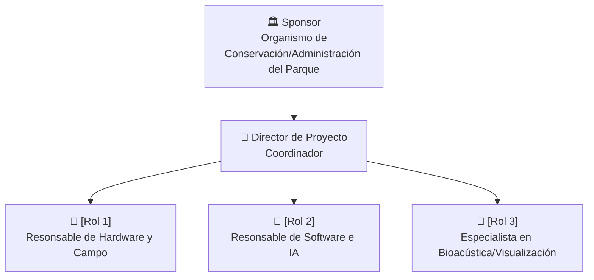

# 🏢 Organización del Proyecto

## Usuarios e interesados (Stakeholders)

| Nombre / Rol | Área | Interés en el proyecto | Influencia |
|--------------|------|------------------------|-----------|
| Directiva de la ONG / Parque Natural | Gestión territorial / Conservación | Disponer de una herramienta autónoma y de bajo costo para justificar la toma de decisiones y reportar el estado de conservación | Alta  |
| Administrador del espacio natural | Conservación /Operaciones de campo  | Conocer la actividad de fauna y detectar zonas con intrusiones o perturbaciones sonoras continuas sin requerir patrullajes permanentes | Alta |
| Comité Científico / Equipo Biológico de la ONG | Investigación y Monitoreo Ecológico | Validar los índices ecológicos (NDSI, ACI) y utilizar los registros de audio para evaluar patrones de biodiversidad a largo plazo. | Alta |
| Comunidad Local y Donantes / Financiadores | Desarrollo Institucional / Difusión | Visualizar los resultados mediante mapas interactivos para verificar el impacto de los proyectos de conservación y justificar fondos | Media |
## Áreas involucradas

- Gestión ambiental: define las necesidades de monitoreo, los sitios de interés y el uso de los indicadores generados.
- Bioingeniería / Electrónica: diseña e implementa dispositivos autónomos de bajo costo, resistentes a la intemperie, con autonomía energética suficiente para campañas en zonas alejadas.
- Procesamiento de señales e Inteligencia Artificial: desarrolla los algoritmos para procesar y clasificar los registros acústicos.
- Biodiversidad / Ciencias ambientales: alida la correlación entre las métricas del software y la biodiversidad real, ajustando parámetros según la fauna del lugar.  
## Equipo del proyecto

| Integrante | Rol en el proyecto | Responsabilidad principal |
|------------|--------------------|--------------------------|
| [COMPLETAR] | Director / Líder de Proyecto | Coordinar el proyecto, gestionar recursos, plazos y entregables y mantener la comunicación con los interesados |
| [COMPLETAR] | Responsable de Hardware e Infraestructura de Campo | Diseñar e implementar el sistema de adquisición de audio, alimentación y almacenamiento |
| [COMPLETAR] | Responsable de Software e IA | Desarrollar el procesamiento de señales, clasificación de eventos acústicos y generación de indicadores |
| [COMPLETAR] | Especialista en Bioacústica y Conservación/Especialista en Biodiversidad / Asesor ambiental | Configurar las métricas de biodiversidad (NDSI, ACI) y validar científicamente las interpretaciones ambientales generadas, definir los grupos de fauna de interés, aportar criterios de interpretación y validar los resultados desde el punto de vista ambiental |
| [COMPLETAR] | Responsable de Datos y Visualización | Organizar la base de datos, generar indicadores y desarrollar la visualización de los resultados |

## Estructura del equipo

---

*Cátedra Gestión de Proyectos · FIUNER · 2026*
