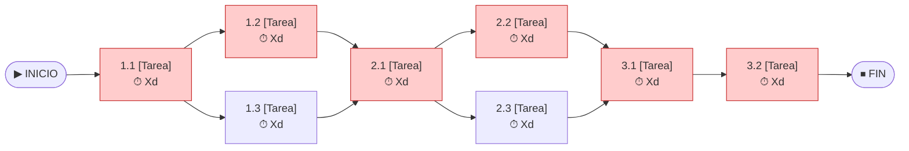

# 🔗 Red de Tareas y Camino Crítico

## Diagrama de precedencias

> Las tareas del **Camino Crítico** se muestran en rojo (holgura = 0).

## Análisis del Camino Crítico

| ID | Tarea | Inicio Temprano | Fin Temprano | Inicio Tardío | Fin Tardío | Holgura | ¿Crítica? |
|----|-------|:-:|:-:|:-:|:-:|:-:|:-:|
| 1.1.1 | Estandarización de parámetros de audio | 0 | [COMPLETAR] | [COMPLETAR] | [COMPLETAR] | [COMPLETAR] | [COMPLETAR] |
| 1.2.1 | Sistema de alimentación autónomo | [COMPLETAR] | [COMPLETAR] | [COMPLETAR] | [COMPLETAR] | [COMPLETAR] | [COMPLETAR] |
| 1.2.2 | Micrófono, placa comercial, almacenamiento SD, gabinete y soportes | [COMPLETAR] | [COMPLETAR] | [COMPLETAR] | [COMPLETAR] | [COMPLETAR] | [COMPLETAR] |
| 1.3.1 | Integración de micrófono y placa comercial | [COMPLETAR] | [COMPLETAR] | [COMPLETAR] | [COMPLETAR] | [COMPLETAR] | [COMPLETAR] |
| 1.3.2 | Configuración de firmware y almacenamiento SD | [COMPLETAR] | [COMPLETAR] | [COMPLETAR] | [COMPLETAR] | [COMPLETAR] | [COMPLETAR] |
| 1.3.3 | Montaje y comprobación de funcionamiento | [COMPLETAR] | [COMPLETAR] | [COMPLETAR] | [COMPLETAR] | [COMPLETAR] | [COMPLETAR] |
| 1.4 | Pruebas de autonomía y funcionamiento en campo | [COMPLETAR] | [COMPLETAR] | [COMPLETAR] | [COMPLETAR] | [COMPLETAR] | [COMPLETAR] |
| 2.1.1 | Diseño de esquema de datos y metadatos | [COMPLETAR] | [COMPLETAR] | [COMPLETAR] | [COMPLETAR] | [COMPLETAR] | [COMPLETAR] |
| 2.2.1 | Algoritmo de cálculo NDSI y ACI | [COMPLETAR] | [COMPLETAR] | [COMPLETAR] | [COMPLETAR] | [COMPLETAR] | [COMPLETAR] |
| 2.2.2 | Clasificador binario Aves vs Perturbación | [COMPLETAR] | [COMPLETAR] | [COMPLETAR] | [COMPLETAR] | [COMPLETAR] | [COMPLETAR] |
| 2.3.1 | Mapa interactivo de puntos de muestreo | [COMPLETAR] | [COMPLETAR] | [COMPLETAR] | [COMPLETAR] | [COMPLETAR] | [COMPLETAR] |
| 2.3.2 | Panel de visualización de indicadores | [COMPLETAR] | [COMPLETAR] | [COMPLETAR] | [COMPLETAR] | [COMPLETAR] | [COMPLETAR] |
| 3.1 | Estandarización del dataset acústico | [COMPLETAR] | [COMPLETAR] | [COMPLETAR] | [COMPLETAR] | [COMPLETAR] | [COMPLETAR] |
| 3.2 | Análisis comparativo zona conservada vs urbana | [COMPLETAR] | [COMPLETAR] | [COMPLETAR] | [COMPLETAR] | [COMPLETAR] | [COMPLETAR] |
| 3.3.1 | Elaboración de informe ambiental para el Sponsor | [COMPLETAR] | [COMPLETAR] | [COMPLETAR] | [COMPLETAR] | [COMPLETAR] | [COMPLETAR] |
| 4.1.1 | Acta de constitución y alcance | [COMPLETAR] | [COMPLETAR] | [COMPLETAR] | [COMPLETAR] | [COMPLETAR] | [COMPLETAR] |
| 4.1.2 | WBS, Cronograma y RACI | [COMPLETAR] | [COMPLETAR] | [COMPLETAR] | [COMPLETAR] | [COMPLETAR] | [COMPLETAR] |
| 4.2 | Seguimiento y Control | [COMPLETAR] | [COMPLETAR] | [COMPLETAR] | [COMPLETAR] | [COMPLETAR] | [COMPLETAR] |
| 4.3 | Cierre | [COMPLETAR] | [COMPLETAR] | [COMPLETAR] | [COMPLETAR] | [COMPLETAR] | [COMPLETAR] |

**Duración total del proyecto:** [COMPLETAR] días

**Camino Crítico:** `INICIO → 1.1 → 1.2 → 2.1 → 2.2 → 3.1 → 3.2 → FIN`

---

*Cátedra Gestión de Proyectos · FIUNER · 2026*
