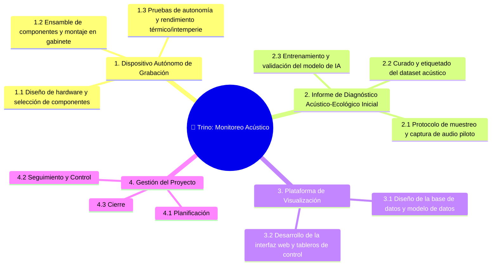

# 🌳 Work Breakdown Structure (WBS)

## Diagrama WBS

## Diccionario de la WBS

| ID | Nombre de la tarea | Entregable asociado | Descripción | Criterio de completitud |
|----|-------------------|---------------------|-------------|------------------------|
| 1.1 | [Diseño de hardware y selección de componentes] | [Dispositivo Autónomo de Grabación] | [Seleccionar la microcomputadora/placa base, micrófonos, sistema de alimentación y almacenamiento adaptados a requerimientos de intemperie.] | [Especificaciones técnicas documentadas y lista de componentes adquirida/aprobada.] |
| 1.2 | [Ensamble de componentes y montaje en gabinete] | [Dispositivo Autónomo de Grabación] | [Integrar el sistema de grabación dentro de una carcasa de protección para pruebas de campo en zonas de Entre Ríos] | [Prototipo físico montado, encendido y operativo para pruebas de grabación] |
| 1.3 | [Pruebas de autonomía y rendimiento térmico/intemperie] | [Dispositivo Autónomo de Grabación] | [Evaluar el consumo energético, la capacidad de grabación continua y la resistencia del prototipo a condiciones ambientales locales] | [Reporte de pruebas validado con cumplimiento de autonomía y estabilidad de captura.] |
| 2.1 | [Protocolo de muestreo y captura de audio piloto] | [Informe de Diagnóstico Acústico-Ecológico Inicial] | [Definir parámetros de muestreo e instalar el prototipo en sitio para recolectar las muestras iniciales de biofonía y antropofonía.] | [Banco de audios recolectados en campo listo para procesamiento.] |
| 2.2 | [Curado y etiquetado del dataset acústico] | [Informe de Diagnóstico Acústico-Ecológico Inicial] | [Procesar los audios grabados, eliminando artefactos e identificando segmentos de señales de fauna y perturbación antropogénica.] | [Dataset limpio y etiquetado para entrenamiento de los algoritmos de IA.] |
| 2.3 | [Entrenamiento y validación del modelo de IA] | [Informe de Diagnóstico Acústico-Ecológico Inicial] | [Entrenar los clasificadores bioacústicos y calcular los índices de biodiversidad y ruido ambiental.] | [Modelo de IA evaluado con métricas de precisión satisfactorias e informe final redactado] |
| 3.1 | [Diseño de la base de datos y modelo de datos] | [Plataforma de Visualización] | [Estructurar las tablas y esquemas para almacenar los metadatos de audio, clasificaciones e índices ecológicos generados.] | [Base de datos desplegada y esquemas de almacenamiento verificados.] |
| 3.2 | [Desarrollo de la interfaz web y tableros de control] | [Plataforma de Visualización] | [Construir el frontend/backend para visualizar la actividad bioacústica y niveles de perturbación ambiental para usuarios finales] | [Plataforma web funcional probada y accesible por los stakeholders.] |

---

*Cátedra Gestión de Proyectos · FIUNER · 2026*
