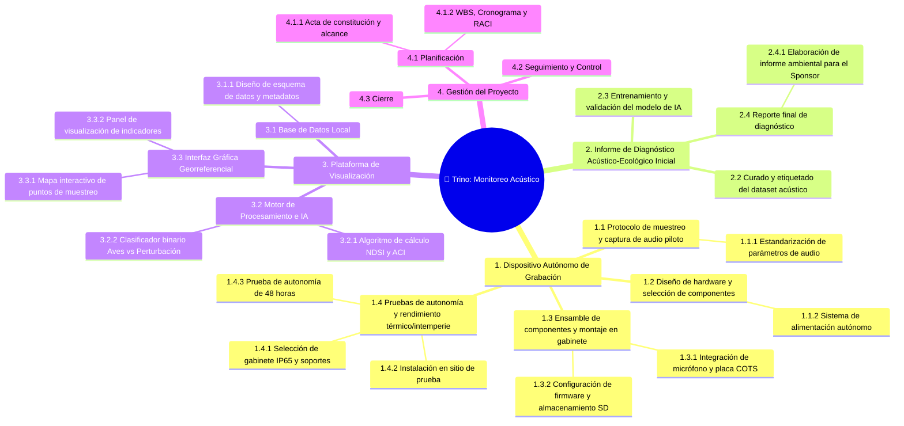

# 🌳 Work Breakdown Structure (WBS)

## Diagrama WBS

## Diccionario de la WBS

| ID | Nombre de la tarea | Entregable asociado | Descripción | Criterio de completitud |
|----|-------------------|---------------------|-------------|------------------------|
| **1.1.1** | Estandarización de parámetros de audio | Dispositivo Autónomo de Grabación | Definir frecuencia de muestreo, tasa de bits, ganancia y formato de archivo para mantener homogeneidad en los audios. | Documento con la definición formal de los parámetros de audio aprobado. |
| **1.1.2** | Sistema de alimentación autónomo | Dispositivo Autónomo de Grabación | Definir y dimensionar el sistema de baterías/energía para garantizado del funcionamiento autónomo en campo. | Esquema de alimentación seleccionado, componentes adquiridos y probados eléctricamente. |
| **1.2.1** | Integración de micrófono y placa COTS | Dispositivo Autónomo de Grabación | Realizar la interconexión física y montaje del micrófono junto con las placas comerciales (COTS). | Micrófono y placa integrados en la estructura interna funcionando correctamente. |
| **1.2.2** | Configuración de firmware y almacenamiento SD | Dispositivo Autónomo de Grabación | Configurar el sistema operativo/firmware y preparar la tarjeta SD para la captura continua y almacenamiento local de audio. | Firmware grabado, tarjeta SD formateada y prueba exitosa de guardado de archivos de audio. |
| **1.3.1** | Instalación en sitio de prueba | Dispositivo Autónomo de Grabación | Desplegar temporalmente el prototipo en una ubicación de prueba real para verificar el comportamiento ambiental. | Dispositivo montado en el sitio de prueba y registrando datos iniciales. |
| **1.3.2** | Prueba de autonomía de 48 horas | Dispositivo Autónomo de Grabación | Medir y verificar la durabilidad de la batería y la continuidad del registro sin interrupciones durante 48 horas continuas. | Log de grabación continuo de 48 horas validado sin fallas energéticas o de sistema. |
| **1.4.1** | Selección de gabinete IP65 y soportes | Dispositivo Autónomo de Grabación | Seleccionar y adquirir la carcasa estanca IP65 y los soportes mecánicos necesarios para la fijación en intemperie. | Gabinete IP65 y soportes seleccionados, adquiridos y verificados físicamente. |
| **2.2** | Curado y etiquetado del dataset acústico | Informe de Diagnóstico Acústico-Ecológico Inicial | Filtrar, segmentar y etiquetar los registros de audio capturados para conformar el dataset de entrenamiento. | Dataset procesado, etiquetado y listo en el repositorio de datos. |
| **2.3** | Entrenamiento y validación del modelo de IA | Informe de Diagnóstico Acústico-Ecológico Inicial | Ajustar y validar los modelos de aprendizaje automático para la detección y clasificación acústica. | Modelo entrenado con métricas de rendimiento y precisión validadas. |
| **2.4.1** | Elaboración de informe ambiental para el Sponsor | Informe de Diagnóstico Acústico-Ecológico Inicial | Redactar y consolidar el informe final con los hallazgos bioacústicos e indicadores de biodiversidad obtenidos. | Documento del informe ambiental finalizado y listo para su presentación al Sponsor. |
| **3.1.1** | Diseño de esquema de datos y metadatos | Plataforma de Visualización | Diseñar la estructura de tablas y relaciones para almacenar mediciones, metadatos e índices generados. | Esquema de la base de datos local definido e implementado. |
| **3.2.1** | Algoritmo de cálculo NDSI y ACI | Plataforma de Visualización | Desarrollar los algoritmos para procesar y calcular los índices acústicos (NDSI y ACI) a partir de los datos. | Código del algoritmo desarrollado, integrado y validado con datos de prueba. |
| **3.2.2** | Clasificador binario Aves vs Perturbación | Plataforma de Visualización | Implementar el modelo clasificador para separar vocalizaciones de aves de eventos de ruido o perturbación humana. | Clasificador binario funcional integrado dentro del motor de procesamiento. |
| **3.3.1** | Mapa interactivo de puntos de muestreo | Plataforma de Visualización | Desarrollar el componente georreferenciado para visualizar la ubicación espacial de los dispositivos de monitoreo. | Módulo de mapa funcional desplegado en la interfaz gráfica. |
| **3.3.2** | Panel de visualización de indicadores | Plataforma de Visualización | Construir el dashboard con gráficos y métricas para visualizar las tendencias de biodiversidad y perturbación. | Panel de control operativo con representación clara de los indicadores. |
| **4.1.1** | Acta de constitución y alcance | Gestión del Proyecto | Formalizar el proyecto, definiendo objetivos, alcance, restricciones, riesgos iniciales y partes interesadas. | Acta de constitución (Project Charter) firmada y aprobada. |
| **4.1.2** | WBS, Cronograma y RACI | Gestión del Proyecto | Elaborar la estructura de desglose del trabajo, la programación temporal y la matriz de asignación de responsabilidades. | Documentos de WBS, Cronograma y Matriz RACI completados y aprobados. |
| 3.2 | [Desarrollo de la interfaz web y tableros de control] | [Plataforma de Visualización] | [Construir el frontend/backend para visualizar la actividad bioacústica y niveles de perturbación ambiental para usuarios finales] | [Plataforma web funcional probada y accesible por los stakeholders.] |

---

*Cátedra Gestión de Proyectos · FIUNER · 2026*
