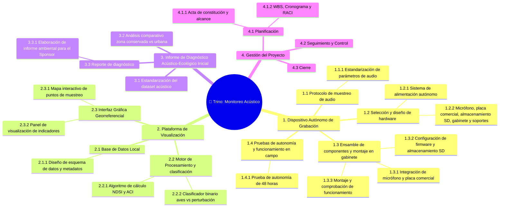

# 🌳 Work Breakdown Structure (WBS)

## Diagrama WBS

## Diccionario de la WBS

| ID | Nombre de la tarea | Entregable asociado | Descripción | Criterio de completitud |
|----|-------------------|---------------------|-------------|------------------------|
| **1.1.1** | Estandarización de parámetros de audio | Dispositivo Autónomo de Grabación | Definir configuración técnica para el hardware de registro de audio y formato de archivo para mantener homogeneidad en los audios. | Documento con la definición formal de los parámetros de audio aprobado. |
| **1.2.1** | Sistema de alimentación autónomo | Dispositivo Autónomo de Grabación | Definir y dimensionar el sistema de baterías/energía para garantizado del funcionamiento autónomo en campo. | Esquema de alimentación seleccionado, componentes adquiridos y probados eléctricamente. |
| **1.2.2** | Micrófono, placa comercial, almacenamiento SD, gabinete y soportes | Dispositivo Autónomo de Grabación |Definir el hardware adecuado según el estándar de parámetros de audio, alimentación y dimensiones físicas del conjunto | Adquisición de los componentes, comprobación de funcionamiento individual y presentación en gabinete. |
| **1.3.1** | Integración de micrófono y placa comercial | Dispositivo Autónomo de Grabación | Realizar la interconexión física y montaje del micrófono junto con las placas comerciales (COTS). | Micrófono y placa integrados en la estructura interna funcionando correctamente. |
| **1.3.2** | Configuración de firmware y almacenamiento SD | Dispositivo Autónomo de Grabación | Configurar el sistema operativo/firmware y preparar la tarjeta SD para la captura continua y almacenamiento local de audio. | Firmware grabado, tarjeta SD formateada y prueba exitosa de guardado de archivos de audio. ||
| **1.3.3** | Montaje y comprobación  de funcionamiento | Dispositivo Autónomo de Grabación | Ensamble total del dispositivo y pruebas de funcionamiento básico. | Dispositivo registra y almacena audio correctamente. |
| **1.4** | Pruebas de autonomía y funcionamiento en campo  | Dispositivo Autónomo de Grabación | Medir y verificar la durabilidad de la batería y la continuidad del registro sin interrupciones durante más de 48 horas continuas. | Certificar la grabación continua de 48 horas validada sin fallas energéticas o de sistema. |
| **2.1.1** | Diseño de esquema de datos y metadatos | Plataforma de Visualización | Diseñar la estructura de tablas y relaciones para almacenar mediciones, metadatos e índices generados. | Esquema de la base de datos local definido e implementado. |
| **2.2.1** | Algoritmo de cálculo NDSI y ACI | Plataforma de Visualización | Desarrollar los algoritmos para procesar y calcular los índices acústicos (NDSI y ACI) a partir de los datos. | Código del algoritmo desarrollado, integrado y validado con datos de prueba. |
| **2.2.2** | Clasificador binario Aves vs Perturbación | Plataforma de Visualización | Implementar y entrenar el modelo clasificador para separar vocalizaciones de aves de eventos de ruido o perturbación humana. | Clasificador binario funcional integrado dentro del motor de procesamiento, que cumpla con el porcentaje de precisión acordado. |
| **2.3.1** | Mapa interactivo de puntos de muestreo | Plataforma de Visualización | Desarrollar el componente georreferenciado para visualizar la ubicación espacial de los dispositivos de monitoreo. | Módulo de mapa funcional desplegado en la interfaz gráfica. |
| **2.3.2** | Panel de visualización de indicadores | Plataforma de Visualización | Construir el dashboard con gráficos y métricas para visualizar las tendencias de biodiversidad y perturbación. | Panel de control operativo con representación clara de los indicadores. |
| **3.1** | Estandarización del dataset acústico | Informe de Diagnóstico Acústico-Ecológico Inicial |Definir horarios de muestreo, duración y horas pico de interes. | Documento metodológico de calibración aprobado por el equipo de bioacústica. |
| **3.2** | Análisis comparativo zona conservada vs urbana  | Informe de Diagnóstico Acústico-Ecológico Inicial | Procesamiento y comparación estadística de las muestras recopiladas en áreas naturales vs. zonas urbanas. | Matriz comparativa de resultados acústico-ecológicos generada y validada. |
| **3.3.1** | Elaboración de informe ambiental para el Sponsor | Informe de Diagnóstico Acústico-Ecológico Inicial | Redactar y consolidar el informe final con los hallazgos bioacústicos e indicadores de biodiversidad obtenidos. | Documento del informe ambiental finalizado y listo para su presentación al Sponsor. |
| **4.1.1** | Acta de constitución y alcance | Gestión del Proyecto | Formalizar el proyecto, definiendo objetivos, alcance, restricciones, riesgos iniciales y partes interesadas. | Acta de constitución (Project Charter) firmada y aprobada. |
| **4.1.2** | WBS, Cronograma y RACI | Gestión del Proyecto | Elaborar la estructura de desglose del trabajo, la programación temporal y la matriz de asignación de responsabilidades. | Documentos de WBS, Cronograma y Matriz RACI completados y aprobados. |
| **4.2** | Seguimiento y Control | Gestión del Proyecto | Monitoreo del estado del proyecto, gestión de desviaciones y actualizaciones. | Actas de reunión registradas. |
| **4.3** | Cierre | Gestión del Proyecto | Evaluación del cumplimiento de entregables y cierre del proyecto. | Informe de cierre entregado y recepción formal aceptada por el Sponsor. |

*Cátedra Gestión de Proyectos · FIUNER · 2026*
